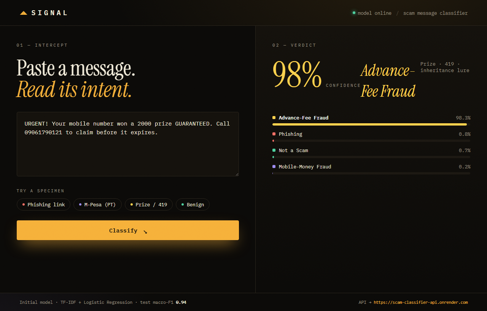
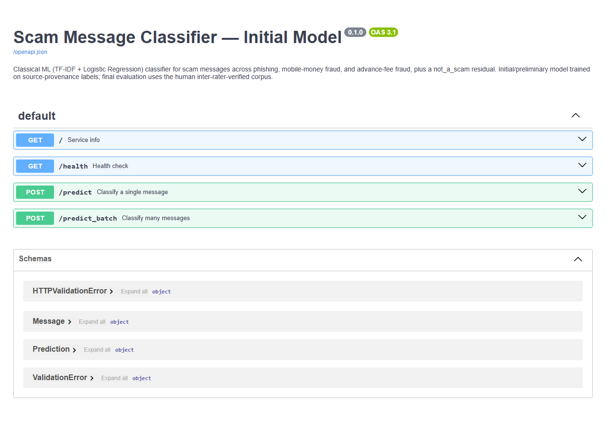

# Scam-Message Classifier — Initial Product Demonstration

A classical ML model that classifies a short message (SMS / email / chat) into one of
four classes, served as a REST API and a web front-end.

| Class | Example |
|---|---|
| `phishing` | "Verify your bank account or it will be suspended: http://bit.ly/x9" |
| `mobile_money_fraud` | "A sua conta M-Pesa foi bloqueada. Envie o seu PIN para reactivar." |
| `advance_fee_fraud` | "You won a £2000 prize GUARANTEED. Call to claim." |
| `not_a_scam` | "Hey, are we still meeting for lunch at 1pm?" |

**Live demo (fully hosted):**
- Web app → https://frontend-inky-xi-23.vercel.app
- API (Swagger) → https://scam-classifier-api.onrender.com/docs
- Repo → https://github.com/Wilsons-Navid/report-Demo

*(The API is on Render's free tier — it sleeps after ~15 min idle, so the first request may take ~30–50s to cold-start.)*

**Full build walkthrough + video guide:** [`docs/PROJECT_WALKTHROUGH.md`](docs/PROJECT_WALKTHROUGH.md) (Word version: `docs/PROJECT_WALKTHROUGH.docx`)

> **Status — initial model.** Trained on source-provenance labels (Nazario phishing corpus,
> MOZ-Smishing, Mendeley smishing, UCI SMS). The final evaluation uses a human
> inter-rater-verified (Cohen's κ) corpus, in progress. Romance / identity-theft /
> synthetic-media categories are future work (no public message datasets exist for them).

## Performance (held-out test set, n = 664)

| Model | Accuracy | Macro-F1 |
|---|---|---|
| **TF-IDF + Logistic Regression** | **0.958** | **0.943** |
| TF-IDF + Random Forest (500 trees) | 0.950 | 0.928 |

Per-class F1 (LogReg): mobile-money **0.99**, phishing **0.96**, not-a-scam **0.96**,
advance-fee **0.86**. Full report + confusion matrices: `ml/notebooks/model_demo.ipynb`.

## Layout

```
ml/
├── notebooks/model_demo.ipynb   the model notebook (EDA, architecture, metrics, inference)
├── src/demo_model.py            TF-IDF + LogReg / RandomForest pipelines
├── serve/app.py                 FastAPI app (Swagger UI) — the deployment MVP
├── data/labelled/demo_labeled.jsonl   4,422 labelled messages
└── models/                      trained classifier + metrics
frontend/                        static web UI (deploys to Vercel)
render.yaml                      one-click API deploy to Render
```

## Setup

```bash
python -m venv .venv && .venv\Scripts\activate     # Windows
pip install -r ml/requirements.txt
```

## Reproduce the model

The labelled dataset is committed, so training is one step:

```bash
python ml/src/demo_model.py            # trains both models, saves best + metrics to ml/models/
```

## Run the API (deployment MVP, Swagger UI)

```bash
python -m uvicorn ml.serve.app:app --reload --port 8000
# open http://127.0.0.1:8000/docs  ->  POST /predict
```

## Run the front-end

```bash
cd frontend && python -m http.server 5500
# open http://127.0.0.1:5500  (API_BASE defaults to http://127.0.0.1:8000)
```

## Designs / interfaces

**Web front-end** (live classification result)



**API — Swagger UI**



The model notebook's data visualisations (class/source/language distributions, length
profile, class×source provenance heatmap, confusion matrices, per-class F1, top terms)
are embedded in `ml/notebooks/model_demo.ipynb`.

## Deployment plan

- **API → Render** (free tier): `render.yaml` trains the model at build time from the
  committed dataset and starts Uvicorn. Set `ALLOWED_ORIGINS` to the front-end URL.
- **Front-end → Vercel** (static): root directory `frontend`. Point it at the API by
  editing `API_BASE` in `frontend/app.js` or visiting `…/?api=https://your-api`.
- **Next:** retrain on the human κ-verified corpus for the final evaluation.

## Video demo

`<add 5–10 min video link>` — notebook (data → architecture → metrics), then live
Swagger `/predict` (or the web front-end) across the four classes.
